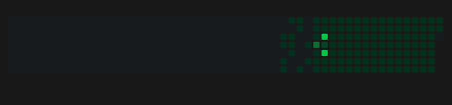

<!-- Hero: theme-aware so name + tagline stay readable on light/dark GitHub -->
<picture>
  <source media="(prefers-color-scheme: dark)" srcset="https://capsule-render.vercel.app/api?type=cylinder&height=210&color=0:0D1117,50:6366F1,100:0D1117&text=%20Arghyadeep%20Sarkar%20&fontSize=42&fontColor=FFFFFF&fontAlignY=36&desc=I+teach+robots+to+think...+then+apologize+when+they+hallucinate&descSize=14&descAlignY=62&animation=scaleIn&textBg=true&stroke=0D1117&strokeWidth=2"/>
  <source media="(prefers-color-scheme: light)" srcset="https://capsule-render.vercel.app/api?type=cylinder&height=210&color=0:F6F8FA,45:E0E7FF,100:F6F8FA&text=%20Arghyadeep%20Sarkar%20&fontSize=42&fontColor=0D1117&fontAlignY=36&desc=I+teach+robots+to+think...+then+apologize+when+they+hallucinate&descSize=14&descAlignY=62&animation=scaleIn&textBg=true&stroke=FFFFFF&strokeWidth=2"/>
  
</picture>

 

 

  

---

## 🎭 Who Dis?

<table width="100%"><tr>
<td width="65%">

**Senior AI/ML Engineer** · 8+ years of turning **"can't we just ask ChatGPT?"** into actual production systems.

I build **GenAI, LLM, RAG, Agentic AI & multimodal** stuff that works in prod — not just in a Jupyter notebook at 2 AM.

Specialties: **AI Agents, MCP orchestration, Graph RAG**, vector DBs, and convincing Kubernetes to behave.

**Battle-tested in:** Semiconductor · Manufacturing · AR/VR · Conversational AI · "Why is the bot rude?" tickets

</td>
<td width="35%" align="center">

 
<small style="color:#8B949E !important;"><i>"It works on my GPU"</i> — Me, probably</small>

</td>
</tr></table>

  

    🚨 BREAKING: Local man deploys RAG pipeline, documents actually retrieved &nbsp;•&nbsp; 🎉 Agent completed task without hallucinating (once) &nbsp;•&nbsp; ☕ Coffee levels critical, LoRA training continues &nbsp;•&nbsp; 📢 "Just add another agent" — famous last words &nbsp;•&nbsp; 🐛 Bug fixed by renaming variable &nbsp;•&nbsp; 🚨 BREAKING: Local man deploys RAG pipeline &nbsp;•&nbsp; 🎉 Agent completed task without hallucinating (once) &nbsp;•&nbsp;
  

---

## 🧰 Things I Yell At (Skills)

LLMsAgentic AIMCPRAGGraph RAGTool CallingPEFT/LoRARLHF
LangChainLangGraphLangSmithHuggingFacevLLMOllama
ElasticsearchMilvusFAISSPyTorchTransformers
AWSSageMakerKubernetesDockerMLflowCI/CD

  

---

## 💼 Where I've Broken Prod (Legally)

<table width="100%"><tr>
<td width="55%" valign="top">

**🔴 Red Hat** · Sr. Data Scientist · *Apr 2025 – Present*

> *"What if 10 agents talked to each other?"* — Me, calmly, to a very nervous PM.

- Enterprise **multi-agent AI** with MCP — **10+ workflows** that actually orchestrate
- Secure tool invocation (so agents don't rm -rf anything)
- Fault-tolerant orchestration — agents *will* fail creatively

**🟢 HPE** · Sr. Data Scientist · *Sep 2022 – Apr 2025*

> Indexed **millions of docs**. Mistral-7B finally had something to read.

- GenAI · SageMaker · MLflow · PEFT · LoRA
- **RAG at scale** → LoRA-fine-tuned **Mistral-7B**
- **Milvus** hybrid search · LangChain/LangGraph/LangSmith

**🟣 Lavorro** · Founding Engineer · *Jun 2021 – Sep 2022*

> Built a chatbot for AR/VR. Yes, the bot also wears virtual pants.

- RAG chatbot · **90%+ accuracy** · sub-second retrieval · GPUs exhausted

<b style="color:#F093FB !important;">🕰️ The Origin Story (earlier jobs)</b>

<b>Lincode Labs</b> — Defect detection + search for chip engineers 
<b>DataVal Analytics</b> — Boats, forecasts, Solr search 
<b>Vital Labs</b> — ML security · <b>Deuglo</b> — Java + RFID era

</td>
<td width="45%" valign="top">

## 🌍 OSS (I Touch Grass in Repos)

<b style="color:#4ECDC4 !important;">🩵 <a href="https://github.com/langfuse/langfuse">Langfuse</a></b> 
<small style="color:#8B949E !important;">Made ClickHouse ingestion less scary. Watch your pipeline cry in real-time.</small>

<b style="color:#F093FB !important;">🤝 <a href="https://github.com/crewAIInc/crewAI">crewAI</a></b> 
<small style="color:#8B949E !important;">HITL workflows, silent failure detection. Agents failing quietly is NOT team behavior.</small>

## 📜 Patents (Lawyers Liked These)

<small style="color:#C9D1D9 !important;">
<b style="color:#FFE66D !important;">US 63/223,911</b> — MTBF improvement for semiconductor fab (NLP) 
<b style="color:#FFE66D !important;">US 63/223,905</b> — Smart-Bot for chip manufacturing
</small>

## 🎓 School of Hard Tokens

<b style="color:#FFFFFF !important;">JIS College of Engineering</b> 
<small style="color:#8B949E !important;">B.Tech CSE · 2013 – 2017 · Where printf met destiny</small>

</td>
</tr></table>

---

<table width="100%"><tr>
<td width="33%">

### 🏆 Flex Zone

<small>
🎤 Speaker at AI conferences 
✍️ Blogs on LLMs & PEFT 
💡 Startup whisperer (RAG advice) 
🤖 Chatbots that don't ghost users
</small>

</td>
<td width="33%">

### 🗣️ Human Languages

<b style="color:#FFFFFF !important;">English · Hindi · Bengali</b>  
<small style="color:#8B949E !important;">(LLM fluent in all. Unfortunately.)</small>

</td>
<td width="34%">

### ☕ Freelance

<small>
Custom LLM chatbots · ES · FAISS · LangChain  
<i style="color:#8B949E !important;">DM before your CEO asks ChatGPT to "just build it"</i>
</small>

</td>
</tr></table>

---

<i>"Give a man a fish, he eats for a day. 
Teach a man to RAG, he indexes for a lifetime."</i> — Me, at 3 AM

 

 

<picture>
  <source media="(prefers-color-scheme: dark)" srcset="./assets/github-contribution-grid-snake.gif"/>
  <source media="(prefers-color-scheme: light)" srcset="./assets/github-contribution-grid-snake-light.gif"/>
  
</picture>

 

 

  

<b style="color:#F093FB !important;">Thanks for stopping by!</b>

